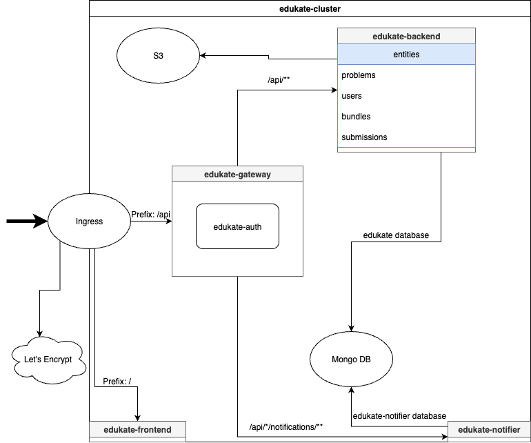

# Edukate Project Overview

Edukate is a comprehensive educational platform designed to facilitate learning and teaching.
The system is built as a microservices architecture, with each component handling specific functionality.

## System Architecture

The Edukate platform consists of the following components:

1. **API Gateway** — Entry point for all client requests
2. **Backend Service** — Core business logic and data processing
3. **Notifier Service** — Handles notifications and alerts
4. **Frontend Application** — User interface
5. **Supporting Infrastructure** — MongoDB and MinIO



## Submodules

### edukate-gateway

The API Gateway serves as the entry point for all client requests. It handles:

- Request routing to appropriate services
- Authentication and authorization
- API documentation aggregation

This module integrates the authentication functionality and routes requests to the backend and notifier services _from outside the cluster_.

#### edukate-auth

This is a library module (not a standalone service) that provides authentication functionality to the gateway.
It includes:

- JWT token generation and validation
- Cookie processing

### edukate-backend

The Backend Service handles the core business logic of the application, including:

- Problem aggregation
- Submission creation
- Bundles — private or public problem collections

### edukate-notifier

The Notifier Service is responsible for sending notifications to users, such as:

- Bundle invites
- System announcements
- Emails (tbd)

### edukate-common

This is a shared library module that contains common components used by multiple services:

- Security configurations
- Utility classes
- Shared domain models
- Common service implementations
- Notification models

### edukate-frontend

The Frontend Application provides the user interface for the platform, built with React.

### edukate-chart

Contains Helm charts for deploying the application to Kubernetes environments.

## Setup and Running Instructions

### Prerequisites

- Java 23
- Docker and Docker Compose
- Node.js and npm (for frontend development)
- Kubernetes and Helm (for production deployment)

### Running the Services

Each service can be run independently with the appropriate profile.

#### Backend Service

```bash
./gradlew :edukate-backend:bootRun --args='--spring.profiles.active=dev,secure,local,notifier'
```

**Note that backend also runs MinIO and MongoDB in Docker**

The backend service will be available at http://localhost:5800.

#### Gateway Service

```bash
./gradlew :edukate-gateway:bootRun --args='--spring.profiles.active=dev,secure'
```

The gateway service will be available at http://localhost:5810.

#### Notifier Service

```bash
./gradlew :edukate-notifier:bootRun --args='--spring.profiles.active=dev,secure'
```

The notifier service will be available at http://localhost:5820.

#### Frontend Application

```bash
cd edukate-frontend
npm install
npm run dev
```

The frontend application will be available at http://localhost:80.

### API Documentation

Swagger UI is available at http://localhost:5810/swagger when running the gateway service. It provides documentation for all services.

## Spring Profiles

The application supports several Spring profiles for different environments:

### Backend Service

- **dev**: Development environment with local MongoDB and MinIO
- **secure**: Enables security features 
- **local**: Local development with a specific MinIO endpoint — needed to connect to MinIO bucket to fetch problem images when used in local network (e.g., phone) 
- **notifier**: Enables `HttpNotifierService` bean that allows to send notifications

### Gateway Service

- **dev**: Development environment with services running on localhost
- **secure**: Enables security features
- **notifier**: Enables `HttpNotifierService` bean that allows to send notifications

### Notifier Service

- **dev**: Development environment with local MongoDB
- **secure**: Enables security features
- **notifier**: Enables `HttpNotifierService` bean that allows to send notifications

## Environment Variables

For production deployment, the following environment variables need to be set:

### Backend Service

- `SPRING_DATA_MONGODB_URI`: MongoDB connection URI
- `S3_REGION`: S3 region
- `S3_KEY`: S3 access key
- `S3_SECRET`: S3 secret key
- `S3_BUCKET`: S3 bucket name
- `S3_ENDPOINT`: S3 endpoint URL

### Gateway Service

- `JWT_SECRET`: Secret key for JWT token generation
- `HOST_NAME`: Hostname for the gateway

### Notifier Service

- `SPRING_DATA_MONGODB_URI`: MongoDB connection URI

## Production Deployment

For production deployment, the application can be deployed to a Kubernetes cluster using the Helm chart in the edukate-chart module:

```bash
helm install edukate ./edukate-chart -f ./edukate-chart/values-prod.yaml --set dockerTag=0.1.0-rc.0.143-1167897
```

Note that `--set dockerTag=0.1.0-rc.0.143-1167897` sets a container version to deploy.

## Development Workflow

1. Make changes to the code
2. Run tests (lol) to ensure functionality
3. Start the required services with the appropriate profiles
4. Test the changes in the development environment
5. Submit a pull request for review

## Contributing to the Project

We welcome contributions to the Edukate project! Here's how you can contribute:

### Getting Started

1. Fork the repository
2. Set up your development environment following the instructions above
3. Create a new branch for your feature or bug fix

### Making Changes

1. Make your changes to the codebase
2. Write or update tests as necessary
3. Ensure all tests pass
4. Update documentation if needed

### Submitting Changes

1. Commit your changes with clear, descriptive commit messages
2. Push your changes to your fork
3. Submit a pull request to the main repository
4. Respond to any feedback from code reviewers

### Code Style

- Follow the existing code style and conventions
- Use meaningful variable and method names
- Write clear comments and documentation

### Reporting Issues

If you find a bug or have a feature request, please create an issue in the repository with:

1. A clear, descriptive title
2. Detailed steps to reproduce the issue (for bugs)
3. Expected and actual behavior
4. Any relevant logs or screenshots

Thank you for contributing to Edukate!